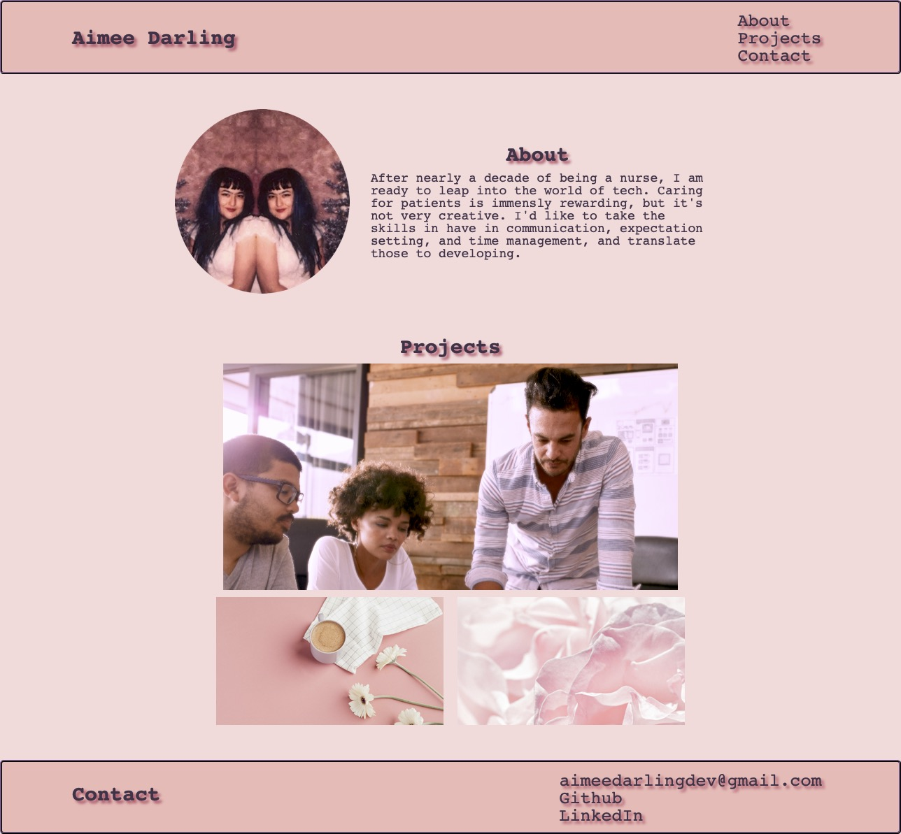

# aimeedarlingportfolio

## Description

A prelimiary portfolio to showcase my current CSS skills. These skills include use of flexbox, smooth scrolling links, using media queries to show responsive design, and using variables to quickly make design changes.

## Installation

Visit site [here](https://aimeedarling.github.io/aimeedarlingportfolio/)

## Usage

Screenshot of completed work.

## Credits

[Profesional README Guide](https://coding-boot-camp.github.io/full-stack/github/professional-readme-guide)

[Semantic HTML](https://www.internetingishard.com/html-and-css/semantic-html/)

[A Completed Guide to Flexbox](https://css-tricks.com/snippets/css/a-guide-to-flexbox/#aa-background)

[How TO - Smooth Scrool](https://www.w3schools.com/howto/howto_css_smooth_scroll.asp#section1)

## License

See license in repo

